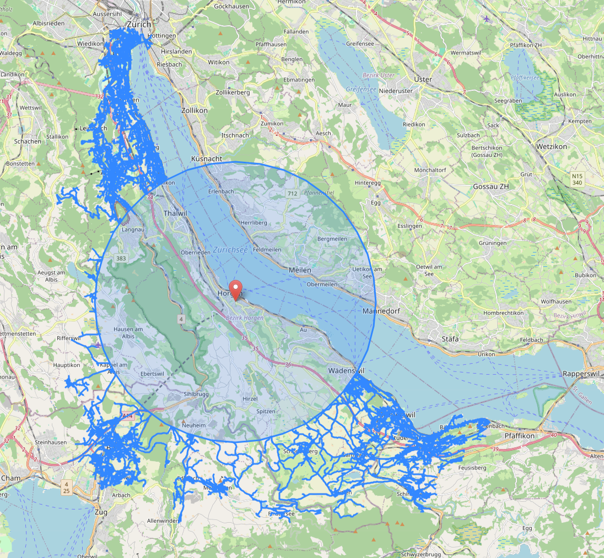

# INSTALLATION

This requires Node and Rust.

Run `wasm-pack build --target web` in the `rust-ev-calc` directory.
Then `node app.js` in the `backend` directory.

The server will then be available at `http://localhost:3000`

# EXAMPLE RESULT

The circle covers the area closer to the origign than any point where the car runs out of charge.
The lines show all places reachable outside the circle. 